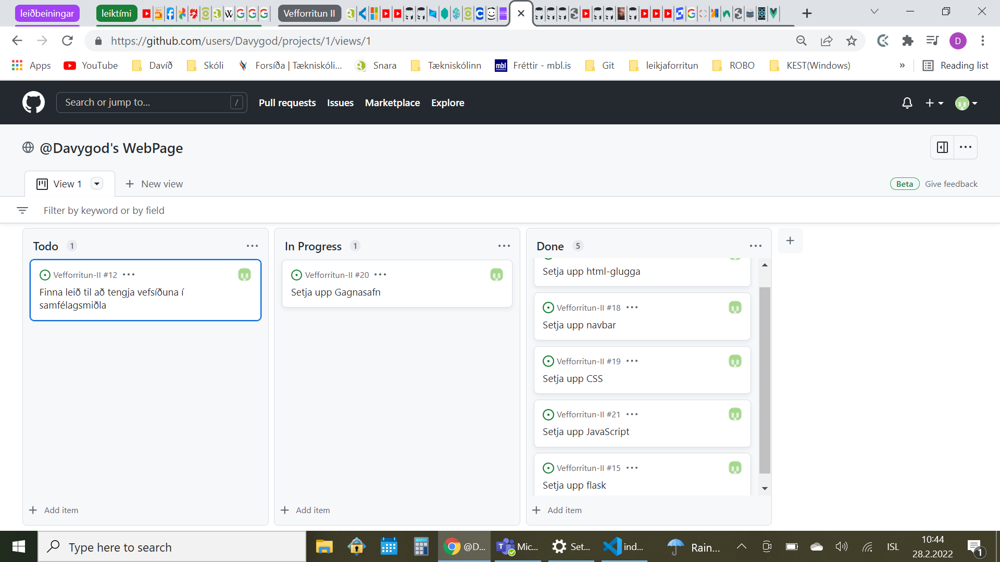

# ÍslLeikir.is
> Davíð Þór Torfason,
> Vefforritun-II,
> Tölvubraut,
> Tækniskólinn Háteigsvegur

## Lýsing
Íslenskur tölvuleikjaupplýsingavefur fyrir íslenska aðdáendur, unglinga og fullorðna, sem gefur lýsingu ákveðinns leiks sem þeir hafa spilað þegar þeir voru yngri og vilja endurrifja næstu kynslóðum. Fjallað er einnig um framleiðendur og útgefendur leiksins, hvar hann fæst og hvort hann sé í hæfi til að vera þýddur með íslensku tali fyrir börn sem skilja ekki ensku.  
Með öðrum orðum: þetta er samfélagslegvefsíða sem notendur kynna leiki sem þeir hafa spilað eða lært um til þess að meta um hvort hægt sé að talsetja þá yfir á íslensku fyrir yngri börn sem vilja spila leikina með íslensku tali heldur enn ensku.

### Sem "Notandi" vil ég:
* skoða kynningu tölvuleiks í eftirfarandi leikjatölvu og fyrirtæki, hver saga hennar er og gagnrýni og hvort ég mæli með að gera hann nógu frægann þannig að hægt verði að bæta við íslensku talsetningu ef mögulegt
* geta bætt við mína eigin umsögn á leikinn ásamt heimildum og/eða bæta við nýjann leik ásamt heimildum í vefsíðuna, og bæta við myndefni og/eða myndbönd til nánari lýsingar og vakið áhuga hjá hinum notendunum
* geta búið til aðgang til þess að hafa leyfi til að bæta við umsagnir og dóma, fengið tilkynningar um hvernig þær fóru og hvort ég vilji svara þeim
* geta búið til aðgang með öðrum forritum eins og Google, Facebook og Discord til að létta fyrir innskráningu mína
* geta skoðað nýjustu fréttir á heimasíðu þ.á.m. nýjar hugmyndir, uppákomur og fleira
* getað haft samband við stjórnendur vefsíðunnar ef ég lendi í vandræðum með hana eða vil koma fram einhverja tillögu um kosti hennar og galla sem þurfi að laga
* geta séð reglur síðunnar augljóslega á sem aðvörun _**áður**_ enn ég ætla að búa til hugmynd mína svo ég geri ekki eitthvað af mér annaðhvort í vinnslu eða í umsögnum
* geta búið til beiðni fyrir leiki sem ég vil óska öðrum til að kynna

### "Stjórnandinn" verður: 
* að setja upp reglur fyrir notendur sem annaðhvort setja upp nýjar hugmyndir og/eða umsagnir
   1. Notendurnir verða að hafa einhverja reynslu eða þekkingu um leikinn og gefa út heimildir því að annars þyrfti stjórnandinn að eyða þeim
   2. Ef notendur eru skráðir með tölvupóst þá ætti að vera hægt að fá tilkynningar frá síðunni ef t.d. einhverjar af umsögnum þeirra hafi verið eyddar og ástæðuna fyrir það (Þeir mega samt svara póstunum ef það er eitthvað sem þeir vilja spyrja nánar)
* að geta ógilt aðgang á notendum sem frömdu einhver afbrot á vefsíðunni (sjá Aðvörun efst) _**og**_ getað sent kæru
* að stjórna birtingu frétta sem birtar eru á vefsíðunni (_**einnig**_ leiki og beiðni)

### Skjámyndir

 
 

### Skjáupptaka

### Flæðirit

### Wireframes

### Samantekt
* Hvaða hönnunarmynstur, framework og söfn eru notuð?
   1. Notað er html, css og javascript sem hönnunarmynstur
   2. Flask er aðal safnið fyrir gögn vefsíðunnar
   3. Balsamiq er "framework"
* Hver væru næstu skref í forgangsröð?
   1. Finna stuðningsmenn
   2. Að fá gagnasafn til að virka samkvæmt "Lýsingu"
   

### Heimildir
* [Build a Responsive Website | HTML, CSS Grid, Flexbox & More](https://www.youtube.com/watch?v=p0bGHP-PXD4)
* [Build A Responsive Gaming Website Using HTML, CSS & JavaScript](https://www.youtube.com/watch?v=rdpUUK39wPA)
* [Python Flask From Scratch - [Part 1] - Getting Started](https://www.youtube.com/watch?v=zRwy8gtgJ1A)
* [Python Flask From Scratch [Part 2] - User Registration](https://www.youtube.com/watch?v=addnlzdSQs4)
* [Python Flask From Scratch [Part 3] - Login & Access Control](https://www.youtube.com/watch?v=QEMtSUxtUDY)
* [Python Flask From Scratch [Part 4] - Dashboard & Articles](https://www.youtube.com/watch?v=EgnyWxKFwjs)
* [Python Flask From Scratch [Part 5] - Edit & Delete Articles
](https://www.youtube.com/watch?v=Us9DuF4KWUE)
